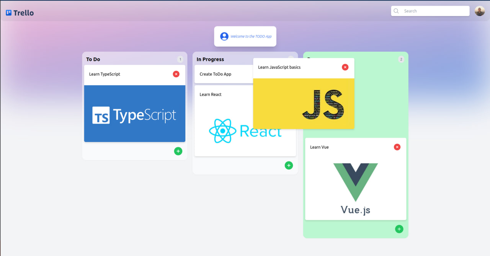

# Sample Todo DnD App



## Tools Used

&nbsp;
&nbsp;
&nbsp;
&nbsp;
&nbsp;
&nbsp;
&nbsp;
&nbsp;


✔️ JavaScript\
✔️ TypeScript\
✔️ Next.js\
✔️ React\
✔️ React Beautiful DnD\
✔️ Zustand\
✔️ Tailwind\
✔️ Headlessui\
✔️ Appwrite\

## Short description

Here you can see my experience with TypeScript, Next.js, React and some related technologies and libs. There are styling using the **Tailwind CSS**, Drag and Drop implementation by **React Beautiful DnD** state management by **Zustand**, database by **Appwrite**, and pretty modal using **Headless UI**.

## Structure
```
├── .github/
├── .next/
├── app
│   ├── api
│   │   └── generateSummary
│   │        └── route.ts
│   ├── favicon.ico
│   ├── globals.css
│   ├── layout.tsx
│   └── page.tsx
├── components
│   └── {component}.tsx
├── libs
│   └── {external_logic}.ts
├── node_modules
├── public
├── store
│   └── {store}.ts
├── .env
├── .eslintrc,json
├── .gitignore
├── appwrite.ts
├── next.config.js
├── next.env.d.ts
├── openai.ts (for openAI API)
├── package.json
├── package-lock.json
├── postcss.config.js
├── README.md
├── taiwind.config.ts
├── tsconfig.json
└── typings.ts
```
---


